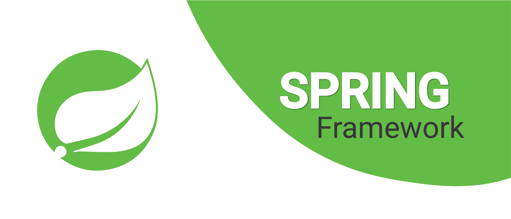

:author: Wiktor Rup
ifdef::env-github[]
:tip-caption: :bulb:
:note-caption: :information_source:
:important-caption: :heavy_exclamation_mark:
:caution-caption: :fire:
:warning-caption: :warning:
endif::[]

= SpringXMLConfig

== Co to jest?
W tym repozytorium znajdziesz przykładowe zadania oraz prezentację przedstawiającą konfigurację aplikacji springowej przez pliki XML. +
Zagadnienia:

 . Podstawy konfiguracji xmlowej - setter, konstruktor, fabryka ziaren
 . Łączenie kilku konfiguracji
 . Zasięg ziaren
 . Tworzenie prostej aplikacji z wykorzystaniem kontrolera, serwisu i repozytorium
 . Dobre praktyki

=== Instrukcja:
Aby wykonać wszystkie ćwiczenia, zacznij od pliku `package-info.java` w pakiecie [yellow]#_a_wstrzykiwanie_zależności_#. Podążaj za opisaną tam instrukcją.

Kiedy skończysz opisane tam zadania, przejdź do pakietu [yellow]#_b_scope_i_import_# i również podążaj za instrukcją z tamtejszego `package-info.java`.

Ostatnie zadanie jest opisane w pliku `c_mvc/package-info.java`.

W razie problemów skorzystaj z zamieszczonej w repozytorium prezentacji.

*Miłej pracy!*